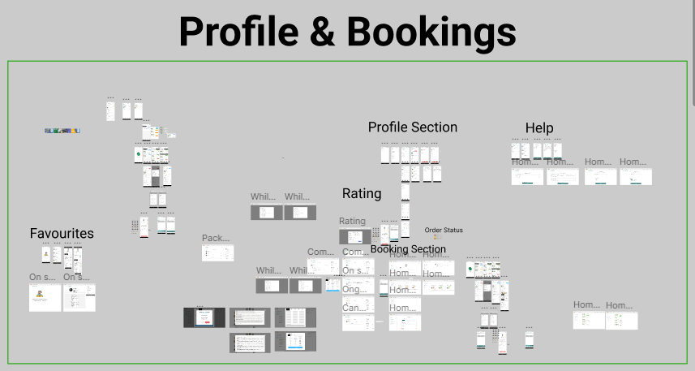

<h1 align="center">Hi 👋, I'm <a href="https://kkp785216.github.io/krishna-portfolio/" target="_blank">Krishna</a></h1>
<h3 align="center">A experienced frontend React developer from India</h3>

  

- 🔭 I’m currently working on [OyeBusy Technology Pvt. Ltd.](https://www.oyebusy.com/gurgaon/)

- 🌱 I’m currently learning More Deep into **Full Stack, Testing and Optimization**

- 👨‍💻 All of my projects are also available at
  [https://kkp785216.github.io/krishna-portfolio](https://kkp785216.github.io/krishna-portfolio)

- 💬 Ask me about **React, Nextjs, SSR, Best Practices**

- 📫 How to reach me **kkp785216@gmail.com** || **+91 8858899958**

- ⚡ Fun fact **Chai tastes way better than Coffee | Change my mind!**

 

<h3 align="left">Languages and Tools:</h3>

  
  
  
  
  
  
  
  
  
  
  

 

## My Experience at [OyeBusy Technology Pvt. Ltd.](https://www.oyebusy.com/gurgaon/)

Hi, I am experienced front-end developer. I have worked for 9 months in Oyebusy which was a startup. I worked with a lot of technologies like Nextjs13, Redux, and Typescript. 50+ hotfixes, and 3 production release

<table>
  <tbody>
    <tr>
      <td>
        <strong><a href="https://www.oyebusy.com/gurgaon/">Homepage Flow</a></strong>
        
      </td>
      <td>
        <strong><a href="https://www.oyebusy.com/gurgaon/electrician/">Service Landing Page</a></strong>
        
      </td>
    </tr>
    <tr>
      <td>
        <strong><a href="https://www.oyebusy.com/gurgaon/electrician/">Order Flow</a></strong>
        
      </td>
      <td>
        <a href="https://www.oyebusy.com/user/bookings/">
          <strong><a href="https://www.oyebusy.com/user/bookings/">Profile and Booking</a></strong>
          
        </a>
      </td>
    </tr>
  </tbody>
</table>

 

## End to end Learning Practise based Projects [Checkout the Portfolio](https://kkp785216.github.io/krishna-portfolio/)
<table>
  <tbody>
    <tr>
      <td>
        <strong><a href="https://github.com/kkp785216/gym-react">Full-Stack Newspaper</a></strong>
        
        <a href="https://newspaper-kkp785216.vercel.app/">Live Demo</a>
      </td>
      <td>
        <strong><a href="https://github.com/kkp785216/gym-react">GYM - React</a></strong>
        
        <a href="https://kkp785216.github.io/gym-react">Live Demo</a>
      </td>
      </td>
    </tr>
    <tr>
      <td>
        <strong><a href="https://github.com/kkp785216/youtube-clone">YouTube - Clone</a></strong>
        
        <a href="https://kkp785216.github.io/youtube-clone/">Live Demo</a>
      </td>
      </td>
      <td>
        <a href="https://github.com/kkp785216/vegamovie">
          <strong><a href="https://github.com/kkp785216/vegamovie">Vega Movie</a></strong>
          
        </a>
        <a href="https://kkp785216.github.io/vegamovie/">Live Demo</a>
      </td>
    </tr>
    <tr>
      <td>
        <strong><a href="https://github.com/kkp785216/amazon-challenge">Amazon Clone</a></strong>
        
        </a>
        <a href="https://amazon-challenge-kkp785216.vercel.app/">Live Demo</a>
      </td>
      </td>
      <td>
        <strong><a href="https://github.com/kkp785216/android-store">Android - Store</a></strong>
        
        </a>
        <a href="https://kkp785216.github.io/android-store">Live Demo</a>
      </td>
    </tr>
  </tbody>
</table>

 

  

